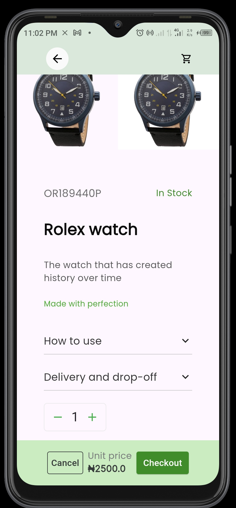

# Shopasharrie: HNG11 Task 4

This project is a project to retrieve data from [timbu.cloud](https://timbu.cloud) API, display them on a screen, and create a good flow showing how a customer can add a product to cart checkout the product and have a history of this completed order and its details also. This API requires you have an APIkey, and some other credentials like organization id, and app id, before you can perform some actions on it.

## How To Run

Make sure you have Flutter set up on your computer.

You can then clone the repository with the command bellow:

`git clone https://github.com/orihac/shopsharrie.git`

The change directory to the cloned project's directory using:

`cd shopashrrie/`

When you are in the directory use the below code to run the app.

`flutter run -d <preferred device type>`

## Installation
For you to run the app on a physical device, you can download the applicatio the link below:

[Please Download here](https://drive.google.com/file/d/1YzCAlzvqkxSZw2JYWIOwJ94y-LJF6nPj/view?usp=sharing)

When you are done downloading, click the shopasharrie.apk file, follow the prompts and install.

You can demo the app on appetize.io when you follow the below link.

[Demo on Apetize.io here](https://appetize.io/app/b_6zwltrtc3zqqh7fq4oqbvk4vy4)

# About the App
The application is about getting data supplied to [timbu.cloud](https://timbu.cloud), from an API to the frontend of the application, and implement a full checkout flow, with the successful order details also kept in a persistant storage like a local database or file, where the user can also view the details of the order and also delete the order.

When you want to get a list of items, you make a `GET` call to the endpoint `/products`. Which provides list of products data like,images, product price, availability of product, and some other data like category.

To get only one item, you can make a `GET` request call to the endpoint `/products/{product_id}` where `product_id` is required.

The Timbu platform can help sellers to put out their products out there easily, and help the developer have an easy implementation of an e-commerce app across different platforms.

### Images of the App

some of the App's images are seen below.

 

  

  

